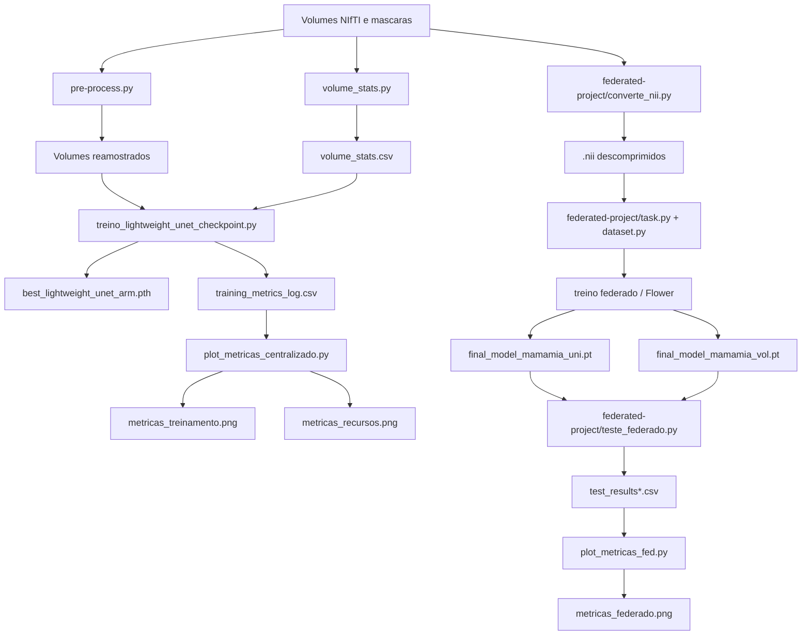

# MAMA-MIA

Repositorio para experimentos de segmentacao de lesoes mamarias em volumes NIfTI, com duas linhas principais de trabalho:

1. treinamento centralizado de uma Lightweight U-Net em CPU
2. fluxo federado com Flower, usando o mesmo modelo e o mesmo criterio de avaliacao volumetrica

O projeto foi organizado para lidar com volumes 3D, mas o treino e a inferencia trabalham fatia a fatia em 2D. A avaliacao final reconstrói o volume do paciente para calcular Dice volumetrico por caso.

## Visao geral do fluxo



## Estrutura do repositorio

```text
.
├── pre-process.py
├── volume_stats.py
├── treino_lightweight_unet_checkpoint.py
├── plot_metricas_centralizado.py
├── plot_metricas_fed.py
├── csv/
│   ├── train_test_splits.csv
│   └── volume_stats.csv
├── federated-project/
│   ├── converte_nii.py
│   ├── dataset.py
│   ├── task.py
│   ├── teste_federado.py
│   ├── docker-compose.yml
│   ├── client/
│   │   └── Dockerfile
│   ├── requirements.txt
│   ├── final_model_mamamia_uni.pt
│   ├── final_model_mamamia_vol.pt
│   └── data/
│       ├── DUKE/
│       ├── ISPY1/
│       ├── ISPY2/
│       └── NACT/
└── resultados/
    ├── Centralizado/
    └── Federado/
```

## O que cada script faz

### Raiz do projeto

#### `pre-process.py`
Reamostra volumes NIfTI para spacing isotropico de `1.0 x 1.0 x 1.0` mm.

O script:
- percorre as imagens e mascaras dos datasets listados em `IMG_DATASET`
- usa `scipy.ndimage.zoom` para ajustar a resolucao
- usa interpolacao linear para imagens e nearest neighbor para mascaras
- ignora arquivos de pre-contraste com sufixo `_0000.nii.gz`

Observacao importante:
- ele trabalha por caminho relativo e espera que os diretórios de dados estejam no formato definido no proprio arquivo
- revise os caminhos antes de executar em uma nova organizacao de pasta

#### `volume_stats.py`
Calcula media e desvio padrao por volume, usando apenas voxels de foreground quando possivel.

Saida:
- `volume_stats.csv`

Uso tipico:
- gerar estatisticas antes do treino centralizado ou federado
- normalizar cada volume com a propria media e desvio do CSV

#### `treino_lightweight_unet_checkpoint.py`
Treino centralizado completo da Lightweight U-Net em CPU.

O script inclui:
- arquitetura `LightweightUNet` com convolucoes depthwise separaveis
- `DiceBCELoss` com mistura de Dice e BCE
- treino com `channels_last`
- acumulacao de gradiente
- checkpoint para retomada (`checkpoint_ultimo.pth`)
- early stopping por Dice volumetrico de validacao
- log por epoca em CSV

Saidas principais:
- `best_lightweight_unet_arm.pth`
- `checkpoint_ultimo.pth`
- `training_metrics_log.csv`

#### `plot_metricas_centralizado.py`
Le os CSVs de log do treino centralizado e gera graficos de:
- loss e Dice de treino/validacao
- tempo de CPU e uso de RAM

Tambem calcula medias por dataset.

Saidas principais:
- `metricas_treinamento.png`
- `metricas_recursos.png`
- `average_metrics_per_dataset.csv`

Observacao:
- por padrao o script procura arquivos como `training_metrics_log_duke.csv` no diretorio atual
- se os logs estiverem em `resultados/Centralizado/`, ajuste os caminhos ou execute a partir dessa pasta

#### `plot_metricas_fed.py`
Extrai metricas de logs do Flower e plota a evolucao por round.

Saida principal:
- `metricas_federado.png`

Observacao:
- o script espera logs com nomes definidos no dicionario `ARQUIVOS`
- se os arquivos tiverem outros nomes, renomeie-os ou ajuste o mapa interno

### Pasta `federated-project/`

#### `converte_nii.py`
Converte todos os arquivos `.nii.gz` para `.nii` descomprimido e remove o original apenas apos validar a nova copia.

Motivo:
- o acesso fatia a fatia em `.nii.gz` reabre e descomprime o arquivo inteiro repetidamente
- o formato `.nii` permite acesso mais eficiente via memory mapping

ATENCAO:
- o script e destrutivo por design
- ele apaga os `.nii.gz` originais depois da conversao bem-sucedida

#### `dataset.py`
Define `MamaMia3DOnTheFlyDataset`.

Responsabilidades:
- abrir volumes NIfTI de forma preguiçosa
- mapear fatias por volume e por indice `z`
- normalizar cada fatia com a media/desvio do `volume_stats.csv`
- redimensionar para `256 x 256`
- devolver `(img_tensor, mask_tensor, vol_idx, z_idx)` para permitir a reconstrucao volumetrica depois

O dataset suporta dois modos:
- `only_tumor_slices=True`: usa apenas fatias com lesao
- `only_tumor_slices=False`: inclui fatias com lesao, vizinhas e uma amostra de fatias vazias

#### `task.py`
Centraliza a logica compartilhada entre treino e inferencia federados.

Contem:
- `LightweightUNet`
- `Net = LightweightUNet`, para o Flower importar a rede por nome
- `DiceBCELoss`
- `calculate_real_dice`
- `calculate_volume_dice`
- `obter_caminhos_por_lista`
- `load_data_train`
- `load_data_val`
- `train`
- `test`

Pontos importantes:
- o treino local usa split 80/20 a partir da coluna `train_split`
- a validacao usa `shuffle=False` para manter as fatias agrupadas por volume
- a avaliacao volumetrica reconstrói o paciente e calcula Dice 3D por volume

#### `teste_federado.py`
Avaliador standalone do modelo salvo no conjunto de teste de cada dataset.

O script:
- carrega `final_model_mamamia_uni.pt` ou outro checkpoint configurado
- avalia DUKE, ISPY1, ISPY2 e NACT separadamente
- calcula Dice, IoU, precision e recall por volume
- executa dois modos de fatias:
  - `selecionadas`
  - `completo`

Saidas:
- `<modelo>_test_results.csv`
- `<modelo>_test_results_por_volume.csv`

#### `docker-compose.yml`
Define quatro servicos de cliente:
- `client-duke`
- `client-ispy1`
- `client-ispy2`
- `client-nact`

Cada servico:
- usa `client/Dockerfile`
- tem limite de memoria de 2 GB
- monta o diretorio correspondente em `/app/data`

#### `client/Dockerfile`
Imagem base simples para os clientes:
- `python:3.11-slim`
- instala as dependencias do `requirements.txt`
- deixa o container em espera com `sleep infinity`

## Organizacao dos dados

### CSVs globais na raiz

#### `csv/train_test_splits.csv`
Define a divisao de treino e teste por paciente.

Formato:
```text
train_split,test_split
DUKE_001,DUKE_019
DUKE_002,DUKE_021
...
```

#### `csv/volume_stats.csv`
Armazena media e desvio padrao por volume.

Formato:
```text
file,mean,std
images/DUKE_001/DUKE_001_0003.nii.gz,27.68,32.50
...
```

### Dados federados em `federated-project/data/`

Cada dataset segue a mesma ideia:

```text
data/<DATASET>/
├── images/
├── segmentations/
│   └── expert/
├── train_test_splits.csv
├── volume_stats.csv
├── test_results.csv
├── test_results_por_volume_completo.csv
└── test_results_por_volume_selecionadas.csv
```

Datasets presentes:
- `DUKE`
- `ISPY1`
- `ISPY2`
- `NACT`

### Pasta `resultados/`

Organizacao dos artefatos ja gerados:

```text
resultados/
├── slice_distribution_training.csv
├── Centralizado/
│   ├── average_metrics_per_dataset.csv
│   ├── training_metrics_log_duke.csv
│   ├── training_metrics_log_ispy1.csv
│   ├── training_metrics_log_ispy2.csv
│   └── training_metrics_log_nact.csv
└── Federado/
    ├── Uniforme/
    │   ├── FED_UNI.txt
    │   ├── DUKE_UNI.txt
    │   ├── ISPY1_UNI.txt
    │   ├── ISPY2_UNI.txt
    │   ├── NACT_UNI.txt
    │   ├── final_model_mamamia_uni_test_results.csv
    │   └── final_model_mamamia_uni_test_results_por_volume.csv
    └── Volumetrico/
        ├── FED_VOL.txt
        ├── DUKE_VOL.txt
        ├── ISPY1_VOL.txt
        ├── ISPY2_VOL.txt
        ├── NACT_VOL.txt
        ├── final_model_mamamia_vol_test_results.csv
        └── final_model_mamamia_vol_test_results_por_volume.csv
```

## Dependencias

O projeto usa Python 3.11 e depende principalmente de:

- `torch`
- `torchvision`
- `numpy`
- `pandas`
- `nibabel`
- `opencv-python-headless`
- `scikit-learn`
- `matplotlib`
- `tqdm`
- `psutil`
- `flwr`
- `ray`

As dependencias completas estao em:
- `federated-project/requirements.txt`

## Setup rapido

### 1. Criar ambiente

```bash
python3.11 -m venv .venv
source .venv/bin/activate
pip install -r federated-project/requirements.txt
```

### 2. Preparar dados

Garanta que os volumes e mascaras estejam organizados no formato esperado pelos scripts que voce vai executar.

Para o fluxo federado, a pasta `federated-project/data/<DATASET>/` deve conter:
- `images/`
- `segmentations/expert/`
- `train_test_splits.csv`
- `volume_stats.csv`

### 3. Gerar estatisticas de volume

```bash
python volume_stats.py
```

### 4. Reamostrar os volumes, se necessario

```bash
python pre-process.py
```

### 5. Treinar o modelo centralizado

```bash
python treino_lightweight_unet_checkpoint.py
```

### 6. Plotar metricas do treino centralizado

```bash
python plot_metricas_centralizado.py
```

### 7. Converter `.nii.gz` para `.nii` no fluxo federado

```bash
cd federated-project
python converte_nii.py
```

### 8. Avaliar um modelo federado salvo

```bash
cd federated-project
python teste_federado.py
```

## Observacoes importantes

- Os scripts usam caminhos relativos; execute cada comando a partir da pasta esperada pelo proprio arquivo.
- O treino centralizado e o avaliador federado foram escritos para CPU.
- O fluxo federado compartilha a mesma arquitetura e a mesma funcao de loss do fluxo centralizado.
- Os modelos `final_model_mamamia_uni.pt` e `final_model_mamamia_vol.pt` sao pesos salvos, nao codigo fonte.
- A pasta `federated-project/client/` contem apenas o Dockerfile de base dos clientes; a orquestracao Flower depende do ambiente de execucao usado pelo projeto.

## Saidas esperadas

Depois de rodar os scripts, voce deve encontrar artefatos como:

- checkpoints `.pth`
- CSVs de metricas por epoca e por volume
- logs `.txt` do federado
- imagens `.png` com graficos de metricas
- modelos finais `.pt`

## Resumo tecnico

### Arquitetura

- U-Net leve com convolucoes depthwise separaveis
- `InstanceNorm2d`
- saída binaria com 1 canal

### Funcao de perda

- mistura de `BCEWithLogitsLoss` e Dice

### Avaliacao

- Dice 2D por batch para monitoramento do treino
- Dice volumetrico 3D para validacao e teste final

### Estrategia de amostragem de fatias

- fatias com lesao sao mantidas
- fatias vizinhas sao adicionadas para contexto
- fatias vazias sao amostradas com uma razao configuravel

---

